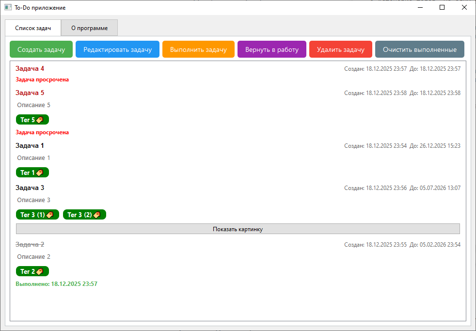

# Что такое ToDo?
ToDo — это приложение для составления и управления задачами на Windows. В приложении реализовано сохранение задач в базу данных, используя sqlite3, система тегов, прикрепление фото к задачам, экспорт задач в таблицу и т.д, Создано мной.

# Функционал
Вкладка списка задач:

Вкладка создания задачи:

## Вкладка списка задач

* При нажатии на кнопку «Создать задачу» откроется окно создания задачи. Создание задачи включает в себя:
    * Создание названия.
    * Создание описания. Оно частично отобразится на задаче в списке задач.
    * Установка дедлайна. Дедлайн не может быть меньше текущей даты. По истечении срока задача пометится как просроченная. Дату дедлайна можно выбрать через выпадающий календарь.
    * Установка тегов. На одну задачу можно поставить несколько тегов. Создать тег можно при нажатии кнопки «Выбрать теги».
    * Прикрепление картинки. Её можно будет просмотреть при нажатии кнопки на задаче в списке задач.

- При двойном нажатии на задачу откроется меню редактирования задачи. Можно изменить все параметры задачи, кроме даты создания.
- Кнопка «Выполнить задачу» помечает выбранную задачу как выполненную и переносит её в конец списка задач.
- Кнопка «Вернуть в работу» отменяет действие кнопки «Выполнить задачу».
- Кнопка «Очистить выполненные» удаляет из списка задач все выполненные задачи.

Просроченные задачи находятся в верху списка. Они сортируются по дате дедлайна.
  
Задачи, находящиеся в процессе выполнения сортируются по приближению дедлайна

Выполненные задачи находятся в низу самом списка и сортируются по мере увеличения давности выполнения.

## Вкладка «О программе»
Во вкладке находится кнопка, позволяющая экспортировать все задачи в csv-файл по выбранному пользователем пути.
